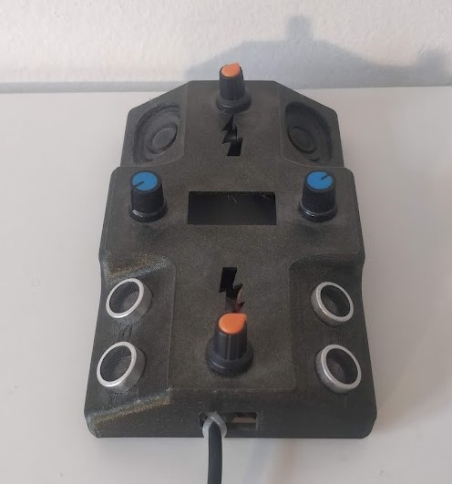

https://youtu.be/geImhKTGpBw?si=5WEOsUlL0evwfZUk <- The thing working on a cool box set, 0.8w speakers 2w amp, pulse no filter.

# Catalan
Funcionament bàsic aparentment correcte. Sensors muntats a uns ~80 graus, sense filtre produeix un sò poc agradable, pro d'evident i curiosa relació entre les dues mans.
Testejat en Arduino Nano, pins amb interrupció hardware requerits.
Considerar estudi d'ús d'entrades/sortides programables de rp2040.

# English
Basic operation apparently correct. Sensors mounted at about ~80 degrees, without a filter produces an unpleasant sound, also the relationship between the two hands is kinda intreresting.
Tested on Arduino Nano, pins with hardware interrupt required.
Consider study using rp2040 programmable inputs/outputs.

